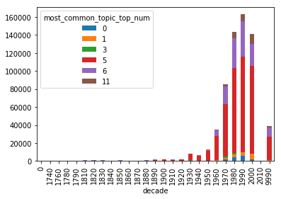
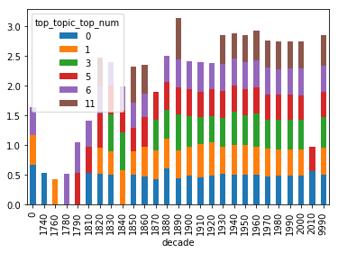
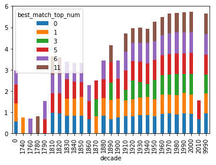

# Charts and Graphs for Data Analysis

The script `pool_process.py` runs on 7 different CPU cores, to spits out the
text into `./output/analalyzed_corpus.json`. One of the big problems with
running NLTK in multiprocessing is that the WordNetLemmetizer has to be
initialized first, before the threading. [Read more about it in this
stackoverflow answer](https://stackoverflow.com/a/27437149). This script creates text file
that needs a bit of massaging to create a python readable dictionary. Part of
the goal of this script is to make a pandas dataframe. 


```python
# thanks to @ninjaaron for help pulling this script section together 
from collections import namedtuple
import json

encode = json.JSONEncoder(ensure_ascii=False).encode

#Book = namedtuple("Book", "ht_id, top_topic, best_match, most_common_topic")
Book = namedtuple("Book", ["ht_id", "year", "subjects", "top_topic", "best_match", "most_common_topic"])
Topic = namedtuple("Topic", "top_num, perc")
BestMatch = namedtuple("BestMatch", "page, top_num, perc")

with open("analyzed_corpus3.json") as fh:
    books = eval(fh.read())


```

The Following code takes the hierarchical dataframe, and flatens it out to be easily imported into a pandas dataframe.  


```python
analyzed_list = []
for book in books.values():
    out_dict = {}
    try:
        dct = book._asdict()
    except AttributeError:
        pass
    out_dict['ht_id'] = dct['ht_id']
    out_dict['year'] = dct['year']
    out_dict['subjects'] = dct['subjects']
    for key, value in dct.items():
        try:
            for inner_key, inner_value in value._asdict().items():
                out_dict[key+'_'+inner_key] = inner_value    
            # dct[key] = value._asdict()
        except AttributeError:
            pass
    analyzed_list.append(out_dict)
```


```python
# This is what each line looks like after we open in it. 
analyzed_list[0]
```


    {'ht_id': 'mdp.39015019393407',
     'year': '1974',
     'subjects': 'Political science History | Conservatism History. | Democracy History. | Liberalism History.',
     'top_topic_top_num': 5,
     'top_topic_perc': 0.3887231835384959,
     'best_match_page': 162,
     'best_match_top_num': 5,
     'best_match_perc': 0.8628564,
     'most_common_topic_top_num': 5,
     'most_common_topic_perc': 97}


Next we create the dataframe we will use, and reorder the columns. 


```python
import pandas as pd
import matplotlib.pyplot as plt
%matplotlib inline
```


```python
df = pd.DataFrame(analyzed_list)
columns = [
     'ht_id',
     'year', 
     'subjects',
     'top_topic_top_num',
     'top_topic_perc',
     'best_match_page',
     'best_match_top_num',
     'best_match_perc',
     'most_common_topic_top_num',
     'most_common_topic_perc',
]
df = df[columns]
```

# Supplementing The Dataframe with Data about each record

The year publication date used for this, can easily be retrieved from the volume output. The year date was pulled in through the HathiTrust FeatureReader. The entire Marc record is available through the feature reader. Unfortunately, I forgot to include the title information in the `pool_process.py`. 

But we do need to add our selected Topic titles.


```python
topic_num2name = {
    0: 'Black Experience',
    1: 'Context of Migrant Experience',
    3: 'Communal Experience',
    5: 'Social, Political, Economic Migrations',
    6: 'Immigration and American Christianity',
    11: 'Religion and Culture',
}
```


```python
import sqlite3
```


```python
# Unfortunately this data is not available in the github repo, but won't be necessary if you include
# The proper additions in the `pool_process.py` script
conn = sqlite3.connect('../data/politheo.db')
cur = conn.cursor()
```


```python
'''
def get_year(row):
    ht_id = row['ht_id']
    query = 'SELECT date FROM hathitrust_rec WHERE htitem_id = ?'
    cur.execute(query, (ht_id, ))
    year = cur.fetchone()
    year = int(year[0].split('-')[0])
    return year
    
    
df['date'] = df.apply(get_year, axis=1)
df.columns
''' 
```


    "\ndef get_year(row):\n    ht_id = row['ht_id']\n    query = 'SELECT date FROM hathitrust_rec WHERE htitem_id = ?'\n    cur.execute(query, (ht_id, ))\n    year = cur.fetchone()\n    year = int(year[0].split('-')[0])\n    return year\n    \n    \ndf['date'] = df.apply(get_year, axis=1)\ndf.columns\n"


```python

```

Sorting the date by the decade. 


```python
df['decade'] = df.apply(lambda x: (int(x['year'])//10)*10, axis=1)
```

## Number of Pages Dominated by a Particular Topic 

This chart shows how many pages are dominated by a particular topic over time. This is grouped by decade.  


```python
most_common_df = df.groupby(['most_common_topic_top_num', 'decade'])['most_common_topic_perc'].sum().unstack('most_common_topic_top_num')
```


```python
most_common_df.plot(kind='bar', stacked=True)
```


    <matplotlib.axes._subplots.AxesSubplot at 0x117c9f410>





This final part saves the script in a png file. 


```python
most_common_plot = most_common_df.plot(kind='bar', stacked=True).get_figure()
most_common_plot.savefig('./output/most_common_plot.png')
```


## Top Topic Averages 

The top_topic column is an average rating of how well the topics match a particular volume. This chart takes an average of those averages by decade to see if there are any decades which have particular highlights on which books where were. 


```python
top_topic_df = df.groupby(['top_topic_top_num', 'decade'])['top_topic_perc'].mean().unstack('top_topic_top_num')
```


```python
top_topic_df.plot(kind='bar', stacked=True)
```


    <matplotlib.axes._subplots.AxesSubplot at 0x117e95990>





```python
# This code saves the chart to a graph. 
top_topic_fig = top_topic_df.plot(kind='bar', stacked=True).get_figure()
top_topic_fig.savefig('./output/top_topic_fig.png')
```


## Best Match 

I tried a couple of approaches to find the best match. The Best match was calculated by finding the topic that best matched the model, and showing which page in the volume that came from. I thought it might be interesting to see which decade had the best, best match. But it turns out that this wasn't a particularly helpful measure. 


```python
best_match_df = df.groupby(['best_match_top_num', 'decade'])['best_match_perc'].max().unstack('best_match_top_num')
```


```python
best_match_df.plot(kind='bar', stacked=True)
```


    <matplotlib.axes._subplots.AxesSubplot at 0x1184b9490>





Digging into the actual dataframe that produces the chart is a little more interesting. For the decades that only have one or two matches, it is because there are only one or two books that represent that decade. This did lead to the realization that we need a more percise way of looking at the best match data. 


```python
best_match_df
```


<div>
<style scoped>
    .dataframe tbody tr th:only-of-type {
        vertical-align: middle;
    }

    .dataframe tbody tr th {
        vertical-align: top;
    }

    .dataframe thead th {
        text-align: right;
    }
</style>
<table border="1" class="dataframe">
  <thead>
    <tr style="text-align: right;">
      <th>best_match_top_num</th>
      <th>0</th>
      <th>1</th>
      <th>3</th>
      <th>5</th>
      <th>6</th>
      <th>11</th>
    </tr>
    <tr>
      <th>decade</th>
      <th></th>
      <th></th>
      <th></th>
      <th></th>
      <th></th>
      <th></th>
    </tr>
  </thead>
  <tbody>
    <tr>
      <th>0</th>
      <td>0.555335</td>
      <td>0.862857</td>
      <td>NaN</td>
      <td>0.880000</td>
      <td>0.680000</td>
      <td>NaN</td>
    </tr>
    <tr>
      <th>1740</th>
      <td>NaN</td>
      <td>0.759997</td>
      <td>NaN</td>
      <td>NaN</td>
      <td>NaN</td>
      <td>NaN</td>
    </tr>
    <tr>
      <th>1760</th>
      <td>NaN</td>
      <td>NaN</td>
      <td>NaN</td>
      <td>NaN</td>
      <td>0.696676</td>
      <td>NaN</td>
    </tr>
    <tr>
      <th>1780</th>
      <td>NaN</td>
      <td>NaN</td>
      <td>NaN</td>
      <td>NaN</td>
      <td>NaN</td>
      <td>0.808000</td>
    </tr>
    <tr>
      <th>1790</th>
      <td>NaN</td>
      <td>NaN</td>
      <td>NaN</td>
      <td>0.679999</td>
      <td>0.862856</td>
      <td>NaN</td>
    </tr>
    <tr>
      <th>1810</th>
      <td>0.985231</td>
      <td>NaN</td>
      <td>NaN</td>
      <td>0.906667</td>
      <td>0.893333</td>
      <td>0.839999</td>
    </tr>
    <tr>
      <th>1820</th>
      <td>0.951826</td>
      <td>NaN</td>
      <td>NaN</td>
      <td>0.931428</td>
      <td>0.931428</td>
      <td>0.755001</td>
    </tr>
    <tr>
      <th>1830</th>
      <td>0.840000</td>
      <td>0.807999</td>
      <td>NaN</td>
      <td>0.893333</td>
      <td>0.833935</td>
      <td>NaN</td>
    </tr>
    <tr>
      <th>1840</th>
      <td>0.842599</td>
      <td>0.807999</td>
      <td>NaN</td>
      <td>0.804002</td>
      <td>0.862857</td>
      <td>NaN</td>
    </tr>
    <tr>
      <th>1850</th>
      <td>0.840000</td>
      <td>0.879999</td>
      <td>NaN</td>
      <td>0.687734</td>
      <td>0.917567</td>
      <td>NaN</td>
    </tr>
    <tr>
      <th>1860</th>
      <td>0.679998</td>
      <td>NaN</td>
      <td>NaN</td>
      <td>0.839999</td>
      <td>0.760000</td>
      <td>NaN</td>
    </tr>
    <tr>
      <th>1870</th>
      <td>NaN</td>
      <td>0.807998</td>
      <td>0.807998</td>
      <td>0.879999</td>
      <td>NaN</td>
      <td>NaN</td>
    </tr>
    <tr>
      <th>1880</th>
      <td>0.840000</td>
      <td>0.839999</td>
      <td>NaN</td>
      <td>0.879999</td>
      <td>0.880000</td>
      <td>NaN</td>
    </tr>
    <tr>
      <th>1890</th>
      <td>0.673333</td>
      <td>0.904000</td>
      <td>0.808000</td>
      <td>0.958261</td>
      <td>NaN</td>
      <td>0.804000</td>
    </tr>
    <tr>
      <th>1900</th>
      <td>0.760000</td>
      <td>0.880000</td>
      <td>NaN</td>
      <td>0.940000</td>
      <td>0.862856</td>
      <td>NaN</td>
    </tr>
    <tr>
      <th>1910</th>
      <td>0.807999</td>
      <td>0.740874</td>
      <td>0.519999</td>
      <td>0.903999</td>
      <td>0.893333</td>
      <td>0.840000</td>
    </tr>
    <tr>
      <th>1920</th>
      <td>0.808000</td>
      <td>0.807999</td>
      <td>0.893333</td>
      <td>0.903999</td>
      <td>0.868341</td>
      <td>0.671111</td>
    </tr>
    <tr>
      <th>1930</th>
      <td>0.860000</td>
      <td>0.829560</td>
      <td>0.734630</td>
      <td>0.949473</td>
      <td>0.893333</td>
      <td>0.718704</td>
    </tr>
    <tr>
      <th>1940</th>
      <td>0.862857</td>
      <td>0.863058</td>
      <td>0.617596</td>
      <td>0.943529</td>
      <td>0.970402</td>
      <td>0.671346</td>
    </tr>
    <tr>
      <th>1950</th>
      <td>0.807999</td>
      <td>0.807999</td>
      <td>0.903999</td>
      <td>0.943529</td>
      <td>0.896471</td>
      <td>0.912727</td>
    </tr>
    <tr>
      <th>1960</th>
      <td>0.912727</td>
      <td>0.929932</td>
      <td>0.903999</td>
      <td>0.952000</td>
      <td>0.936000</td>
      <td>0.862857</td>
    </tr>
    <tr>
      <th>1970</th>
      <td>0.952000</td>
      <td>0.880000</td>
      <td>0.956364</td>
      <td>0.959167</td>
      <td>0.971765</td>
      <td>0.920000</td>
    </tr>
    <tr>
      <th>1980</th>
      <td>0.900811</td>
      <td>0.912727</td>
      <td>0.987027</td>
      <td>0.982545</td>
      <td>0.979575</td>
      <td>0.920000</td>
    </tr>
    <tr>
      <th>1990</th>
      <td>0.958261</td>
      <td>0.961600</td>
      <td>0.893333</td>
      <td>0.969032</td>
      <td>0.979130</td>
      <td>0.936000</td>
    </tr>
    <tr>
      <th>2000</th>
      <td>0.913540</td>
      <td>0.912727</td>
      <td>0.986426</td>
      <td>0.989327</td>
      <td>0.972000</td>
      <td>0.949474</td>
    </tr>
    <tr>
      <th>2010</th>
      <td>0.679998</td>
      <td>NaN</td>
      <td>NaN</td>
      <td>0.880000</td>
      <td>NaN</td>
      <td>NaN</td>
    </tr>
    <tr>
      <th>9990</th>
      <td>0.956364</td>
      <td>0.931428</td>
      <td>0.880000</td>
      <td>0.954286</td>
      <td>0.972571</td>
      <td>0.953334</td>
    </tr>
  </tbody>
</table>
</div>


### Best Match Spread Sheet 

I thought it would be worth digging into the data to see which books had high matches. As well as a high representative of that topic across the book. The first script creates a data frame where the most common topic and the best match topic are the same. This will help promote the aboutness of a particular work will be about the topic we are interseted in. 


```python
# The Top Five Pages for Each topic, Title, and Year

# df.groupby('best_match_top_num')['best_match_top_num', 'ht_id', 'best_match_page', 'best_match_perc'].head()
bmatch_df = df[df['most_common_topic_top_num'] == df['best_match_top_num']].sort_values(by=['best_match_top_num', 'best_match_perc'], ascending=False)
```


```python
# The colomuns of the topic are still all the ones we have
bmatch_df.columns
```


    Index(['ht_id', 'year', 'subjects', 'top_topic_top_num', 'top_topic_perc',
           'best_match_page', 'best_match_top_num', 'best_match_perc',
           'most_common_topic_top_num', 'most_common_topic_perc', 'decade'],
          dtype='object')


These two functions can add additional information from the Hathi Trust database created in the Political Theological project. The title could also be added to the dataframes when the entire corpus is run over the data. 


```python
def find_title(row):
    query = 'SELECT title FROM hathitrust_rec WHERE htitem_id = ?'
    cur.execute(query, (row['ht_id'], ))
    title = cur.fetchone()
    return title[0]

'''

def find_subjects(row):
    query = 'SELECT subject_heading FROM htitem2subjhead WHERE htitem_id = ?'
    cur.execute(query, (row['ht_id'], ))
    subjects = cur.fetchall()
    return ' | '.join([x[0] for x in subjects])
'''
```


    "\n\ndef find_subjects(row):\n    query = 'SELECT subject_heading FROM htitem2subjhead WHERE htitem_id = ?'\n    cur.execute(query, (row['ht_id'], ))\n    subjects = cur.fetchall()\n    return ' | '.join([x[0] for x in subjects])\n"


```python
# apply find_title to the dataframe
bmatch_df['title'] = bmatch_df.apply(find_title, axis=1)
```


```python
# add the topic name to the dataframe
bmatch_df['top_nam'] = bmatch_df.apply(lambda x: topic_num2name[x['best_match_top_num']], axis=1)
```


```python
# add the subjects to the dataframe. 
# Subjects likewise are available in the hathitrust record reader
# bmatch_df['subjects'] = bmatch_df.apply(find_subjects, axis=1)
```


```python
# This cell reorders the columns in a more intuitive order
bmatch_df = bmatch_df[
    ['top_nam',
     'best_match_top_num',
     'ht_id', 
     'title',
     'year',
     'subjects',
     'best_match_page',                     
     'best_match_perc',      
     'most_common_topic_top_num', 
     'most_common_topic_perc'
    ]
].reset_index(drop=True)
```

The following DataFrame shows the top five records for each of the Topic Models


```python
bmatch_df.groupby('best_match_top_num').head(5)
```


<div>
<style scoped>
    .dataframe tbody tr th:only-of-type {
        vertical-align: middle;
    }

    .dataframe tbody tr th {
        vertical-align: top;
    }

    .dataframe thead th {
        text-align: right;
    }
</style>
<table border="1" class="dataframe">
  <thead>
    <tr style="text-align: right;">
      <th></th>
      <th>top_nam</th>
      <th>best_match_top_num</th>
      <th>ht_id</th>
      <th>title</th>
      <th>year</th>
      <th>subjects</th>
      <th>best_match_page</th>
      <th>best_match_perc</th>
      <th>most_common_topic_top_num</th>
      <th>most_common_topic_perc</th>
    </tr>
  </thead>
  <tbody>
    <tr>
      <th>0</th>
      <td>Religion and Culture</td>
      <td>11</td>
      <td>mdp.39015063320546</td>
      <td>New approaches to the study of religion / edit...</td>
      <td>9999</td>
      <td>Religion Study and teaching History 20th century.</td>
      <td>501</td>
      <td>0.953334</td>
      <td>11</td>
      <td>166</td>
    </tr>
    <tr>
      <th>1</th>
      <td>Religion and Culture</td>
      <td>11</td>
      <td>mdp.39015063320546</td>
      <td>New approaches to the study of religion / edit...</td>
      <td>9999</td>
      <td>Religion Study and teaching History 20th century.</td>
      <td>501</td>
      <td>0.953334</td>
      <td>11</td>
      <td>166</td>
    </tr>
    <tr>
      <th>2</th>
      <td>Religion and Culture</td>
      <td>11</td>
      <td>uva.x006167926</td>
      <td>Communio viatorum. v.43-44 2001-2002</td>
      <td>2002</td>
      <td>Theology Periodicals.</td>
      <td>563</td>
      <td>0.949474</td>
      <td>11</td>
      <td>64</td>
    </tr>
    <tr>
      <th>3</th>
      <td>Religion and Culture</td>
      <td>11</td>
      <td>inu.30000004992420</td>
      <td>Synthesis philosophica.</td>
      <td>9999</td>
      <td>Philosophy Periodicals.</td>
      <td>13</td>
      <td>0.926154</td>
      <td>11</td>
      <td>84</td>
    </tr>
    <tr>
      <th>4</th>
      <td>Religion and Culture</td>
      <td>11</td>
      <td>uva.x006090923</td>
      <td>Post-theism : reframing the Judeo-Christian tr...</td>
      <td>2000</td>
      <td>Theism. | Christianity and other religions Jud...</td>
      <td>102</td>
      <td>0.926154</td>
      <td>11</td>
      <td>122</td>
    </tr>
    <tr>
      <th>302</th>
      <td>Immigration and American Christianity</td>
      <td>6</td>
      <td>uva.x000685789</td>
      <td>Nairobi to Vancouver : 1975-1983 : Report of t...</td>
      <td>1983</td>
      <td>Ecumenical movement Congresses.</td>
      <td>267</td>
      <td>0.979575</td>
      <td>6</td>
      <td>96</td>
    </tr>
    <tr>
      <th>303</th>
      <td>Immigration and American Christianity</td>
      <td>6</td>
      <td>ien.35556030059356</td>
      <td>Catholic Eastern Churches : heritage and ident...</td>
      <td>1994</td>
      <td>Catholic Church Malabar rite. | Catholic Churc...</td>
      <td>28</td>
      <td>0.974737</td>
      <td>6</td>
      <td>173</td>
    </tr>
    <tr>
      <th>304</th>
      <td>Immigration and American Christianity</td>
      <td>6</td>
      <td>mdp.39015021629806</td>
      <td>The Mennonite encyclopedia : a comprehensive r...</td>
      <td>9999</td>
      <td>Anabaptists Dictionaries. | Mennonites Diction...</td>
      <td>836</td>
      <td>0.972571</td>
      <td>6</td>
      <td>514</td>
    </tr>
    <tr>
      <th>305</th>
      <td>Immigration and American Christianity</td>
      <td>6</td>
      <td>mdp.39015021629806</td>
      <td>The Mennonite encyclopedia : a comprehensive r...</td>
      <td>9999</td>
      <td>Anabaptists Dictionaries. | Mennonites Diction...</td>
      <td>836</td>
      <td>0.972571</td>
      <td>6</td>
      <td>514</td>
    </tr>
    <tr>
      <th>306</th>
      <td>Immigration and American Christianity</td>
      <td>6</td>
      <td>uva.x030152181</td>
      <td>Grant$ for religion, religious welfare, &amp;amp; ...</td>
      <td>2007</td>
      <td>Endowments United States Directories. | Religi...</td>
      <td>232</td>
      <td>0.972000</td>
      <td>6</td>
      <td>174</td>
    </tr>
    <tr>
      <th>1764</th>
      <td>Social, Political, Economic Migrations</td>
      <td>5</td>
      <td>mdp.39015054048577</td>
      <td>Ulrich's periodicals directory. 2005 v.3</td>
      <td>2005</td>
      <td>Periodicals Directories.</td>
      <td>917</td>
      <td>0.989327</td>
      <td>5</td>
      <td>1386</td>
    </tr>
    <tr>
      <th>1765</th>
      <td>Social, Political, Economic Migrations</td>
      <td>5</td>
      <td>mdp.39015047344901</td>
      <td>Index of conference proceedings received. 1983</td>
      <td>1983</td>
      <td>Congresses and conventions Bibliography Catalogs.</td>
      <td>147</td>
      <td>0.982545</td>
      <td>5</td>
      <td>419</td>
    </tr>
    <tr>
      <th>1766</th>
      <td>Social, Political, Economic Migrations</td>
      <td>5</td>
      <td>mdp.39015047344901</td>
      <td>Index of conference proceedings received. 1983</td>
      <td>1983</td>
      <td>Congresses and conventions Bibliography Catalogs.</td>
      <td>147</td>
      <td>0.982545</td>
      <td>5</td>
      <td>419</td>
    </tr>
    <tr>
      <th>1767</th>
      <td>Social, Political, Economic Migrations</td>
      <td>5</td>
      <td>uc1.b2505364</td>
      <td>British qualifications. 1988 (19th)</td>
      <td>1988</td>
      <td>Professional education Great Britain Directori...</td>
      <td>751</td>
      <td>0.973333</td>
      <td>5</td>
      <td>148</td>
    </tr>
    <tr>
      <th>1768</th>
      <td>Social, Political, Economic Migrations</td>
      <td>5</td>
      <td>uc1.b5032677</td>
      <td>British qualifications : a comprehensive guide...</td>
      <td>1985</td>
      <td>Professional education Great Britain Directori...</td>
      <td>310</td>
      <td>0.972571</td>
      <td>5</td>
      <td>190</td>
    </tr>
    <tr>
      <th>5751</th>
      <td>Communal Experience</td>
      <td>3</td>
      <td>mdp.39015049827705</td>
      <td>Economic relations between Scandinavia and ASE...</td>
      <td>1986</td>
      <td>ASEAN Economic relations Scandinavia. | Scandi...</td>
      <td>240</td>
      <td>0.808000</td>
      <td>3</td>
      <td>84</td>
    </tr>
    <tr>
      <th>5752</th>
      <td>Communal Experience</td>
      <td>3</td>
      <td>mdp.39015049827705</td>
      <td>Economic relations between Scandinavia and ASE...</td>
      <td>1986</td>
      <td>ASEAN Economic relations Scandinavia. | Scandi...</td>
      <td>240</td>
      <td>0.808000</td>
      <td>3</td>
      <td>84</td>
    </tr>
    <tr>
      <th>5753</th>
      <td>Communal Experience</td>
      <td>3</td>
      <td>mdp.39015074694293</td>
      <td>Report. v.16-17 1890-1892</td>
      <td>1892</td>
      <td></td>
      <td>259</td>
      <td>0.760000</td>
      <td>3</td>
      <td>21</td>
    </tr>
    <tr>
      <th>5754</th>
      <td>Communal Experience</td>
      <td>3</td>
      <td>uiug.30112121408451</td>
      <td>Who's who in New England; a biographical dicti...</td>
      <td>1938</td>
      <td>New England Biography.</td>
      <td>405</td>
      <td>0.734630</td>
      <td>3</td>
      <td>510</td>
    </tr>
    <tr>
      <th>5755</th>
      <td>Communal Experience</td>
      <td>3</td>
      <td>uc1.$b398050</td>
      <td>Joy of the worm.</td>
      <td>1969</td>
      <td></td>
      <td>128</td>
      <td>0.720001</td>
      <td>3</td>
      <td>5</td>
    </tr>
    <tr>
      <th>5758</th>
      <td>Context of Migrant Experience</td>
      <td>1</td>
      <td>inu.30000067911481</td>
      <td>Agwọ Loro ibe ya in Imo State : omen or proph...</td>
      <td>1999</td>
      <td>Imo State (Nigeria) Moral conditions. | Imo St...</td>
      <td>176</td>
      <td>0.961600</td>
      <td>1</td>
      <td>37</td>
    </tr>
    <tr>
      <th>5759</th>
      <td>Context of Migrant Experience</td>
      <td>1</td>
      <td>mdp.39015032357645</td>
      <td>Special report - Center for Southeast Asian St...</td>
      <td>1994</td>
      <td>Southeast Asia.</td>
      <td>101</td>
      <td>0.940000</td>
      <td>1</td>
      <td>48</td>
    </tr>
    <tr>
      <th>5760</th>
      <td>Context of Migrant Experience</td>
      <td>1</td>
      <td>mdp.39015060606442</td>
      <td>Sublime historical experience / Frank Ankersmit.</td>
      <td>2005</td>
      <td>History Philosophy.</td>
      <td>489</td>
      <td>0.912727</td>
      <td>1</td>
      <td>174</td>
    </tr>
    <tr>
      <th>5761</th>
      <td>Context of Migrant Experience</td>
      <td>1</td>
      <td>mdp.39015060606442</td>
      <td>Sublime historical experience / Frank Ankersmit.</td>
      <td>2005</td>
      <td>History Philosophy.</td>
      <td>489</td>
      <td>0.912727</td>
      <td>1</td>
      <td>174</td>
    </tr>
    <tr>
      <th>5762</th>
      <td>Context of Migrant Experience</td>
      <td>1</td>
      <td>mdp.39015060606442</td>
      <td>Sublime historical experience / Frank Ankersmit.</td>
      <td>2005</td>
      <td>History Philosophy.</td>
      <td>489</td>
      <td>0.912727</td>
      <td>1</td>
      <td>174</td>
    </tr>
    <tr>
      <th>6108</th>
      <td>Black Experience</td>
      <td>0</td>
      <td>mdp.39015068382343</td>
      <td>The cyclopædia; or, Universal dictionary of ar...</td>
      <td>1819</td>
      <td>Encyclopedias and dictionaries.</td>
      <td>352</td>
      <td>0.985231</td>
      <td>0</td>
      <td>35</td>
    </tr>
    <tr>
      <th>6109</th>
      <td>Black Experience</td>
      <td>0</td>
      <td>njp.32101078163753</td>
      <td>The cyclopædia, or, Universal dictionary of ar...</td>
      <td>1825</td>
      <td>Encyclopedias and dictionaries.</td>
      <td>361</td>
      <td>0.951826</td>
      <td>0</td>
      <td>30</td>
    </tr>
    <tr>
      <th>6110</th>
      <td>Black Experience</td>
      <td>0</td>
      <td>njp.32101078163753</td>
      <td>The cyclopædia, or, Universal dictionary of ar...</td>
      <td>1825</td>
      <td>Encyclopedias and dictionaries.</td>
      <td>361</td>
      <td>0.951826</td>
      <td>0</td>
      <td>30</td>
    </tr>
    <tr>
      <th>6111</th>
      <td>Black Experience</td>
      <td>0</td>
      <td>njp.32101078163753</td>
      <td>The cyclopædia, or, Universal dictionary of ar...</td>
      <td>1825</td>
      <td>Encyclopedias and dictionaries.</td>
      <td>361</td>
      <td>0.951826</td>
      <td>0</td>
      <td>30</td>
    </tr>
    <tr>
      <th>6112</th>
      <td>Black Experience</td>
      <td>0</td>
      <td>mdp.39015068388142</td>
      <td>The cyclopaedia; or, Universal dictionary of a...</td>
      <td>1824</td>
      <td></td>
      <td>361</td>
      <td>0.950610</td>
      <td>0</td>
      <td>28</td>
    </tr>
  </tbody>
</table>
</div>


```python
# This cell saves the dataframe to a 
bmatch_df.to_excel('./output/best_match.xlsx', index=False)
```

### Navigation 

- [Back](exploring_hathi_trust.md)
- [Home](../README.md)
